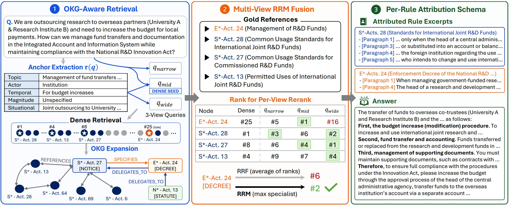

# RefWalk

**Citation-Closure Retrieval and Per-Rule Attribution for Real-World Regulatory Compliance Question Answering**

[](https://arxiv.org/abs/2605.29742)
[](https://huggingface.co/datasets/Y-J-Ju/RegOps-Bench)
[](LICENSE)

---

## Overview



RefWalk has two online stages on top of a pre-built OKG (a NetworkX graph whose
nodes are 조/항/호-level regulation units with typed `REFERENCES` / `DELEGATES_TO`
/ `SPECIFIES` / `PART_OF` edges):

1. **RefWalk Retrieval** — online query *anchoring* (topic + actor/temporal/magnitude/
   situational conditions) → dense seed retrieval → **1-hop OKG expansion** along
   reference/delegation edges → **3-view RRM rerank fusion** (narrow / mid / wide
   views aggregated by reciprocal-rank-max). See `src/retrieval/walker_retrieval.py`.
2. **RefWalk Generation** — feeds the reranked passages to an LLM that emits a
   cited answer, where each clause carries the `node_id` it is grounded in. See
   `src/refwalk.py`.

The repository also ships lightweight comparison baselines (BM25, Dense, Hybrid, Hybrid+Reranker, and a NativeRAG generation baseline) and the offline **Compile** code that builds the OKG from the released `articles.jsonl`.

---

## Installation

Python 3.10+.

```bash
git clone https://github.com/Y-J-Ju/RefWalk.git
cd RefWalk
pip install -r requirements.txt
```

That covers the OKG build, retrieval, inference, and evaluation. Model serving
is separate: the answer LLM, embedder, and reranker run behind
OpenAI-compatible HTTP endpoints served by
[vLLM](https://github.com/vllm-project/vllm), which is not pinned in
`requirements.txt` because the right build depends on your CUDA/GPU setup.

```bash
pip install vllm
```

**Evaluation alone needs neither vLLM nor a GPU** — `cli/evaluate.py` scores a
prediction file with the core dependencies only.

> If `vllm serve` dies during engine startup with an import error from an
> unrelated package, another installed package has registered a broken vLLM
> entry-point plugin. Confirm with `VLLM_PLUGINS="" bash scripts/serve_vllm.sh 4b`.

## Data setup

See [`data/README.md`](data/README.md) for full details. In short:

```bash
# 1. Download RegOps-Bench from Hugging Face
huggingface-cli download Y-J-Ju/RegOps-Bench --repo-type dataset \
    --local-dir data/RegOps-Bench

# 2. Build the OKG offline from the released articles (pure Python, no LLM)
python cli/run_build_okg.py \
    --articles data/RegOps-Bench/articles.jsonl \
    --out-dir  data/okg
```

## Model backend

RefWalk talks to OpenAI-compatible vLLM endpoints. `scripts/serve_vllm.sh <role>`
launches any of them; `--gpu` / `--port` / `--model` override the defaults, and
extra vLLM flags pass through after `--`.

| Role | Default model | Port |
|------|---------------|------|
| `35b` — answer / judge LLM | `Qwen/Qwen3.6-35B-A3B-FP8` | 8035 |
| `4b` — answer LLM | `Qwen/Qwen3.5-4B` | 8040 |
| `embed` — embedding | `Qwen/Qwen3-Embedding-0.6B` | 8090 |
| `rerank` — reranker | `Qwen/Qwen3-Reranker-0.6B` | 8095 |

A run needs an answer LLM, the embedder, and the reranker up at once, so put
them on different GPUs:

```bash
bash scripts/serve_vllm.sh 4b     --gpu 0 &
bash scripts/serve_vllm.sh embed  --gpu 1 &
bash scripts/serve_vllm.sh rerank --gpu 2 &
```

All endpoints/models are overridable via CLI flags or environment variables.

---

## Usage

### Retrieval evaluation

Evaluate all retrieval baselines (BM25 / Dense / Hybrid / Hybrid+Reranker /
Walker_Retrieval) and report R@5, R@10, nDCG@10, FullCov@10:

```bash
bash scripts/eval_retrieval_baselines.sh
# or directly:
python cli/run_retrieval_eval.py \
    --faq      data/RegOps-Bench/regops_bench.jsonl \
    --articles data/okg/okg_nodes.jsonl \
    --okg      data/okg/okg.gpickle \
    --rerank-pool 50 --okg-expand-seed 10 --hit-rule hierarchical \
    --out      experiments/retrieval_baselines
```

### End-to-end RefWalk (retrieval → cited answer → scoring)

```bash
bash scripts/run_refwalk.sh           # generation + scoring, RegOps domain
# under the hood:
python cli/run_refwalk_eval.py   ...  # → predictions JSONL (per-clause citations)
python cli/run_generation_eval.py ... # → claim P/R/F1, citation P/R/F1, fallback flags
```

Generation metrics are computed by `cli/run_generation_eval.py` (claim precision/
recall, citation precision/recall/false-positive). See `src/eval/metrics.py`.

### Evaluating *your* RAG system on RegOps-Bench

`cli/evaluate.py` scores any system from a prediction file — it imports nothing
from RefWalk's retriever or generator, so LangChain, LlamaIndex, GraphRAG
variants, and bespoke pipelines are all scored by the same code on the same
terms. Write one JSON object per benchmark question:

```json
{"qa_id": "L1_ko_001",
 "retrieved_node_ids": ["..._제48조", "..._제48조_제8항"],
 "answer": "타 기관 소속 전문가를 …",
 "cited_node_ids": ["..._제48조_제8항"]}
```

then score it:

```bash
python cli/evaluate.py \
    --predictions experiments/my_rag/preds.jsonl \
    --bench       data/RegOps-Bench/regops_bench.jsonl \
    --corpus      data/okg/okg_nodes.jsonl \
    --dedup-questions \
    --out         experiments/my_rag/scores
```

```
system           R@5     R@10  nDCG@10  FullCov@10      CP      CR     CF1  CF1_strict  CP_para  CR_para  CF1_para     CFP  ctxCFP    n
--------------------------------------------------------------------------------------------------------------------------------------
NativeRAG     0.5234   0.5888   0.4732      0.3896  0.5227  0.5059  0.4665      0.2897   0.2447   0.3371    0.2561  0.0000  0.0061  231
RefWalk       0.5790   0.6602   0.5047      0.4762  0.6795  0.5360  0.5490      0.3806   0.4201   0.5294    0.4272  0.0000  0.0022  231
```

Citation quality is reported at three granularities — 조-level (`CP`/`CR`/`CF1`),
granularity-preserving (`CF1_strict`), and 항/호-level (`*_para`) — because
article-level F1 alone cannot show whether a system found the right paragraph.

Add `--judge` for LLM-judged claim precision/recall/F1. Pass several
`--predictions` files to get one row per system in a single comparison table,
and `--validate-only` to check a file before a full run.

The loader accepts the field names frameworks already emit (`id`, `contexts`,
`response`, …) and reads node_ids out of LangChain `Document` / LlamaIndex
`NodeWithScore` objects, so an adapter is usually unnecessary. The one
integration requirement is that your index carries the corpus `node_id` through
to retrieval output.

**Full specification: [`docs/evaluation.md`](docs/evaluation.md)** — prediction
schema, metric definitions, matching rules, citation recovery, and a worked
integration example.

### Baselines and ablations

| Command | What it runs |
|---------|--------------|
| `scripts/run_walker_rag.sh` | WalkerRetrieval + NativeRAG generation |
| `scripts/run_nativerag.sh` | Dense (+rerank) + LLM, classical RAG floor |

---

## Repository structure

```
src/
├── refwalk.py                # RefWalk workflow (retrieval → cited generation)
├── base_llm.py               # OpenAI-compatible LLM client (vLLM / Gemini)
├── schemas.py                # anchoring output schema
├── retrieval/                # WalkerRetrieval, reranker, corpus, embedding, BM25/Hybrid
├── eval/                     # retrieval + generation metrics, claim/citation matchers
├── baselines/                # NativeRAG, WalkerRAG, BM25/Dense/Hybrid retrievers
├── compile/                  # OKG build from articles.jsonl (offline)
└── utils/                    # hparams, IO, prompts
cli/
├── evaluate.py               # framework-agnostic RegOps-Bench evaluator
├── run_refwalk_eval.py       # RefWalk inference → predictions
├── run_native_rag_eval.py    # NativeRAG inference → predictions
├── run_retrieval_eval.py     # retrieval-baseline sweep
├── run_generation_eval.py    # LLM-judged claim/citation scoring
└── run_build_okg.py          # OKG build from articles.jsonl
scripts/                      # experiment drivers + vLLM server launchers
docs/                         # evaluation protocol, schema reference, benchmark design
```

---

## RegOps-Bench

RegOps-Bench is a regulatory-compliance QA benchmark over Korean national R&D
regulations (국가연구개발혁신법 and related decrees/rules). Questions span four
difficulty levels (L1 single-clause → L4 multi-facet reasoning), each labeled with
ground-truth regulation references for both retrieval and citation evaluation. The
dataset (corpus `articles.jsonl` + QA `regops_bench.jsonl`) is hosted on
[Hugging Face](https://huggingface.co/datasets/Y-J-Ju/RegOps-Bench).

The evaluation set is the **deduplicated 231 questions** (L1/L2/L3/L4 = 48/81/45/57; 56 official + 175 augmented).

### Results

End-to-end on RegOps-Bench (231 questions, `--match-unit article_id`).

**Backbone: Qwen3.6-35B-A3B**

| Method | R@10 | FullCov@10 | Cite-F1 (조) | Cite-F1 (strict) | Cite-F1 (항/호) | Claim-F1 |
|--------|-----:|-----------:|-------------:|-----------------:|----------------:|---------:|
| NativeRAG | 57.9 | 39.0 | 46.7 | 29.0 | 25.6 | 37.7 |
| LightRAG | 45.3 | 32.5 | 40.7 | 27.7 | 23.3 | 37.0 |
| HippoRAG-2 | 42.6 | 29.9 | 47.8 | 29.9 | 29.7 | 37.0 |
| PIKE-RAG | 54.6 | 37.2 | 44.3 | 28.2 | 12.2 | 38.0 |
| **RefWalk (ours)** | **64.3** | **46.8** | **54.9** | **38.1** | **42.7** | **41.1** |

Citation F1 at three granularities: **조** rolls both sides up to the article
ancestor, **strict** preserves whatever granularity each side states, and
**항/호** restricts both sides to clause ids, averaged over the 154 questions
whose gold names a clause. 조-level gold is 68% of the benchmark, so `Cite-F1
(조)` alone cannot show whether a system resolved the right paragraph — the gap
between the 조 and 항/호 columns is where citation-closure retrieval pays off.

Clause-level scoring uses the clause-recovery parser
([`docs/evaluation.md`](docs/evaluation.md) §2). Without it every system scores
0 there, because none of them place 항 ids in their citation lists — they name
the clause in a tag or in prose instead.

Claim-F1 uses the LLM judge (`--judge`), and the retrieval columns come from the
dedicated retrieval runs (`scripts/eval_retrieval_baselines.sh`). All citation
columns are reproduced by the pure-Python path:

```bash
python cli/evaluate.py --dedup-questions --match-unit article_id \
    --bench data/RegOps-Bench/regops_bench.jsonl \
    --corpus data/okg/okg_nodes.jsonl \
    --predictions experiments/refwalk/preds_35b.jsonl \
    --label RefWalk
```

---

## Citation

If you use RefWalk or RegOps-Bench, please cite:

```bibtex
@article{ju2026citation,
  title={Citation-Closure Retrieval and Per-Rule Attribution for Real-World Regulatory Compliance Question Answering},
  author={Ju, Yeong-Joon and Lee, Seong-Whan},
  journal={arXiv preprint arXiv:2605.29742},
  year={2026}
}
```

## License

- **Code:** [MIT](LICENSE)
- **Dataset (RegOps-Bench):** see the license on the [dataset page](https://huggingface.co/datasets/Y-J-Ju/RegOps-Bench).
